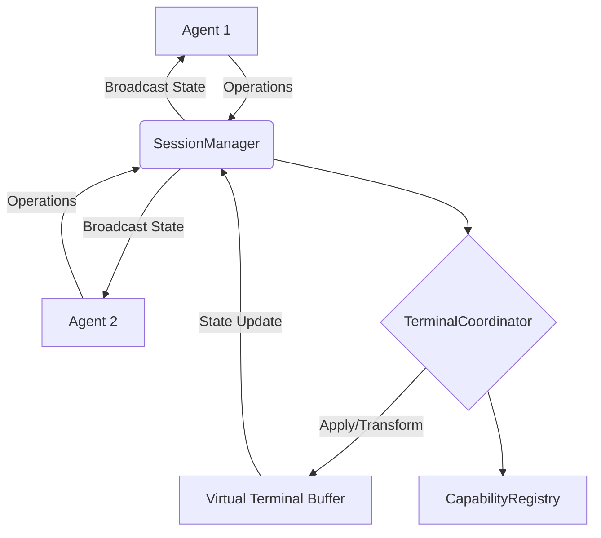

<p align="center">
  
</p>

<h1 align="center">AgentShell</h1>

<p align="center">
  <strong>Real-time collaborative terminal for concurrent AI agent execution.</strong>
</p>

<p align="center">
  <a href="https://github.com/Lumi-node/agent-shell"></a>
  <a href="https://github.com/Lumi-node/agent-shell"></a>
  <a href="https://github.com/Lumi-node/agent-shell"></a>
</p>

---

AgentShell provides a sophisticated framework for enabling multiple autonomous AI agents to operate within a shared, real-time terminal environment. It addresses the complex challenge of concurrent state management by implementing operational transforms and vector clock synchronization across shared terminal sessions.

This system allows agents to concurrently execute commands, modify files, and coordinate actions within a single, shared terminal context, ensuring state consistency even when multiple agents are interacting simultaneously.

---

## Quick Start

```bash
pip install agent_shell
```

```python
from agent_shell.collab.session_manager import SessionManager
from agent_shell.collab.types import AgentSession

# Initialize the session manager
manager = SessionManager()

# Create a new collaborative session
session = manager.create_session(agent_id="agent_alpha")
print(f"Session created: {session.session_id}")
```

## What Can You Do?

### Concurrent Command Execution
Agents can execute shell commands in parallel within the same virtual terminal buffer. The `terminal_coordinator` module manages the multiplexing of pseudo-terminal sessions, ensuring that each agent's input and output is correctly interleaved and processed.

### Conflict Resolution
When multiple agents attempt to modify the terminal state (e.g., typing input or file edits) simultaneously, AgentShell uses operational transforms to merge these operations deterministically, preventing data corruption and maintaining a consistent view for all participants.

### State Synchronization
Vector clocks are employed to track the causality and ordering of operations across distributed agents, guaranteeing that all agents eventually converge on the same, correct state of the shared terminal session.

## Architecture

AgentShell is structured around core collaboration modules that manage state and synchronization.

The **`SessionManager`** acts as the entry point, managing the lifecycle of individual collaborative sessions. Each session relies on the **`CapabilityRegistry`** to track what actions agents are authorized to perform. The heart of the system is the **`terminal_coordinator`** (implied by the use of virtual terminal buffers), which uses **Operational Transforms** to merge concurrent operations received from various agents. **`Types`** defines the standardized data structures (like operations and session states) used across all components.



## API Reference

### `agent_shell.collab.session_manager.SessionManager`
Manages the creation, tracking, and lifecycle of collaborative sessions.

- `create_session(agent_id: str) -> AgentSession`: Initializes a new shared terminal session.
- `get_session(session_id: str) -> AgentSession`: Retrieves an existing session object.

### `agent_shell.collab.types.AgentSession`
Represents the state and metadata of a single collaborative session.

- `session_id: str`: Unique identifier for the session.
- `current_state: dict`: The current, synchronized state of the terminal buffer.
- `vector_clock: dict`: Tracks the causality history of operations.

### `agent_shell.collab.conflict_resolver.ConflictResolver`
Handles the application and transformation of conflicting operations.

- `transform(op1: Operation, op2: Operation) -> tuple[Operation, Operation]`: Returns transformed versions of two operations that conflict.

## Research Background

This project is inspired by distributed systems research concerning concurrent data structures, specifically Operational Transformation (OT) as popularized in collaborative text editing systems. The use of vector clocks is derived from distributed consensus algorithms to ensure causal ordering in asynchronous environments.

## Testing

The project includes 13 test files located in the `tests/` directory, utilizing `conftest.py` for fixture management to validate the correctness of the conflict resolution and session state synchronization logic.

## Contributing

We welcome contributions! Please feel free to fork the repository and submit a Pull Request. Ensure you adhere to the existing coding standards and update the test suite when introducing new features.

## Citation

While this artifact addresses a niche technical pattern, the underlying concepts draw heavily from:
*   Lamport, L. (1978). Time, clocks, and the ordering of events in a distributed system.

## License
MIT