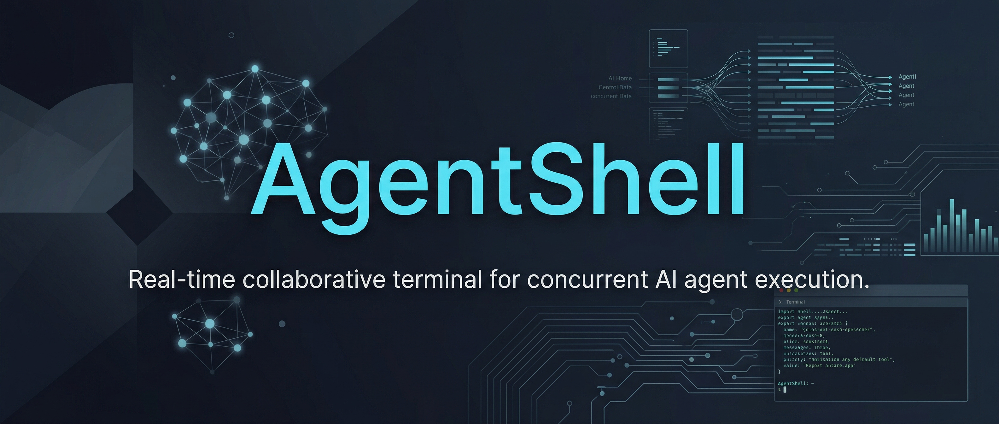
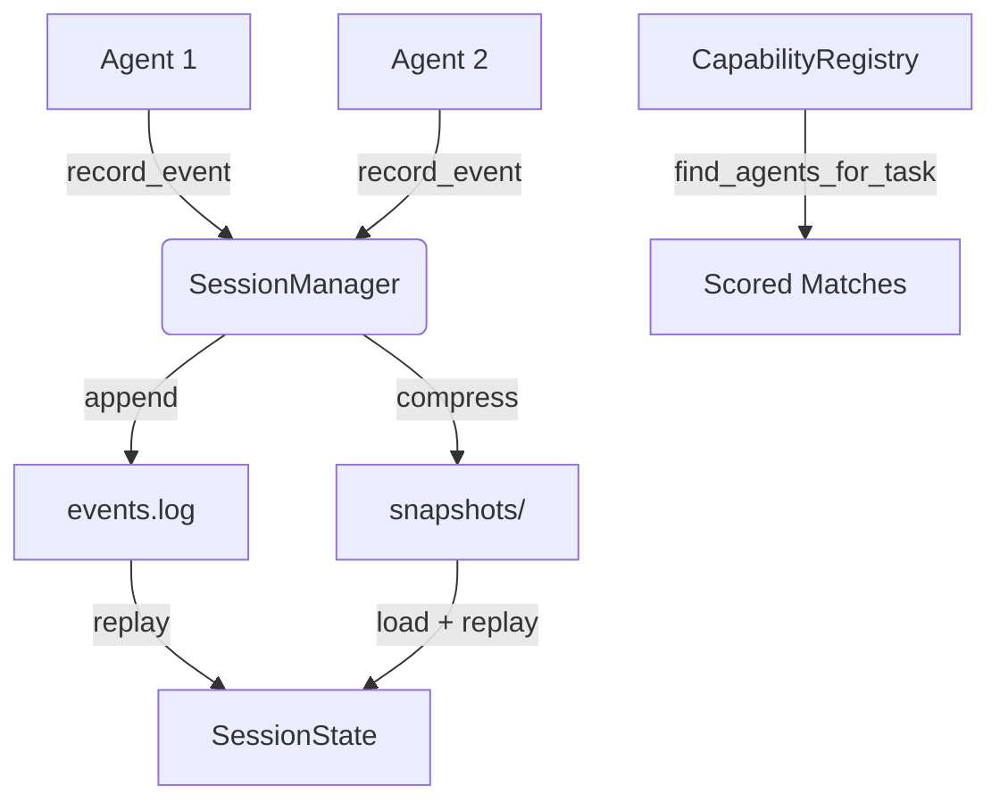

<p align="center">
  
</p>

<h1 align="center">AgentShell</h1>

<p align="center">
  <strong>Real-time collaborative terminal for concurrent AI agent execution.</strong>
</p>

<p align="center">
  <a href="https://github.com/Lumi-node/agent-shell"></a>
  <a href="https://github.com/Lumi-node/agent-shell"></a>
  <a href="https://github.com/Lumi-node/agent-shell"></a>
</p>

---

AgentShell provides an event-sourced coordination layer for multiple AI agents sharing a terminal environment. Every action -- command execution, file edit, directory change, agent registration -- is recorded as an immutable event. Session state is reconstructed deterministically via snapshot + replay, enabling crash recovery without data loss.

A human-in-the-loop approval workflow ensures agents submit commands for review before execution. A capability registry matches tasks to the best-fit agent via keyword scoring.

---

## Quick Start

```bash
pip install agent-shell
```

```python
import time
from collab import SessionManager, CapabilityRegistry

# Initialize a persistent session with event sourcing
session = SessionManager(
    session_name="my_session",
    persist_dir="./sessions"
)

# Register an agent
session.record_event(
    event_type="agent_registered",
    agent_id="coder",
    payload={
        "agent_id": "coder",
        "capabilities": ["python", "debugging"],
        "metadata": {"model": "claude-3"},
        "timestamp": time.time(),
    },
)

# Query session state (reconstructed from events + snapshots)
state = session.get_session_state()
print(state["agents"])           # {'coder': AgentInfo{...}}
print(session.get_cwd("coder"))  # '/'

# Track directory changes
session.set_cwd("coder", "/project/src")

# Record a file edit (stores SHA256 hashes + line range)
session.record_file_edit(
    file_path="/project/src/main.py",
    agent_id="coder",
    old_content="print('hello')",
    new_content="print('hello world')",
)

# Snapshot for fast recovery (gzip-compressed)
session.persist_snapshot()
```

### Capability-Based Task Matching

```python
from collab import CapabilityRegistry

registry = CapabilityRegistry()
registry.register_agent("coder", name="Coder Agent", capabilities=["python", "debugging"])
registry.register_agent("tester", name="Test Agent", capabilities=["python_testing", "qa"])

# Find best agents for a task (returns scored matches)
matches = registry.find_agents_for_task("debug Python tests")
# [('tester', 0.76), ('coder', 0.5)]

registry.get_agent_capabilities("coder")   # ['python', 'debugging']
registry.get_all_agents()                  # {'coder': AgentInfo{...}, 'tester': AgentInfo{...}}
```

## What Can You Do?

### Event-Sourced Session Management
Every action (command execution, file edit, directory change, agent registration) is recorded as an immutable event in an append-only log. Session state is reconstructed deterministically via snapshot + event replay, enabling crash recovery without data loss.

### Human-in-the-Loop Approval
Agents submit commands for human approval before execution. The approval state machine tracks pending, approved, and rejected states with full audit trail. Humans can edit commands before approving them.

### Conflict Detection
When multiple agents edit the same file, the system detects overlapping line ranges and flags conflicts for human resolution. Conflict metadata tracks which agents are involved and which lines overlap.

### Capability-Based Task Routing
The `CapabilityRegistry` matches task descriptions to agents via keyword scoring. Register agents with capability strings (e.g., `"python_testing"`, `"debugging"`) and query for the best-fit agent for any task.

## Architecture

AgentShell is built on two core modules:

The **`SessionManager`** implements event sourcing with an append-only `events.log` and gzip-compressed snapshots. It records 10 event types (agent registration, command execution, file edits, directory changes, approval workflow, task lifecycle, conflict detection) and reconstructs full session state via snapshot + replay. The **`CapabilityRegistry`** stores agent capabilities and matches tasks to agents using substring-based keyword scoring. **`Types`** defines the immutable event hierarchy (frozen dataclasses), TypedDict state structures, and exception classes.



## API Reference

### `collab.SessionManager`
Event sourcing engine for collaborative terminal sessions. Manages append-only event logs with snapshot compression and deterministic crash recovery.

**Constructor:**
- `SessionManager(session_name: str, persist_dir: str)`: Initialize or load a session. Creates `{persist_dir}/{session_name}/events.log` and `snapshots/` directory.

**Event Recording:**
- `record_event(event_type: str, agent_id: str, payload: dict) -> None`: Append immutable event to `events.log`. Auto-generates UUID `event_id` and Unix timestamp. Valid event types: `agent_registered`, `command_executed`, `file_edited`, `directory_changed`, `approval_queued`, `approval_decided`, `approval_executed`, `conflict_detected`, `task_created`, `task_status_changed`.
- `record_file_edit(file_path: str, agent_id: str, old_content: str, new_content: str) -> None`: Record a `FileEditedEvent` with SHA256 content hashes and computed line range.

**State Queries:**
- `get_session_state() -> SessionState`: Reconstruct complete state from latest snapshot + event replay (or full replay if no snapshot).
- `list_agents() -> dict[str, AgentInfo]`: Return all active agents.
- `get_cwd(agent_id: Optional[str] = None) -> str`: Return agent's current working directory (defaults to `"/"`).
- `get_recent_commands(limit: int = 10) -> list[CommandRecord]`: Return last N commands, chronologically ordered.
- `set_cwd(agent_id: str, new_cwd: str) -> None`: Record a `DirectoryChangedEvent`.

**Snapshots:**
- `persist_snapshot() -> None`: Write gzip-compressed snapshot to `snapshots/snapshot-{timestamp}.bin`.
- `replay_from_snapshot(snapshot_timestamp: float) -> SessionState`: Load snapshot at or before given timestamp, replay subsequent events, return state.

### `collab.CapabilityRegistry`
Agent capability storage and task-to-agent matching via keyword scoring.

- `register_agent(agent_id: str, name: str, capabilities: list[str]) -> None`: Register agent with capability strings.
- `find_agents_for_task(task_description: str) -> list[tuple[str, float]]`: Return `(agent_id, score)` pairs sorted by descending match score (0.0--1.0).
- `deregister_agent(agent_id: str) -> None`: Remove agent (idempotent).
- `get_agent_capabilities(agent_id: str) -> list[str]`: Get capabilities (raises `KeyError` if not found).
- `get_all_agents() -> dict[str, AgentInfo]`: Return all registered agents.

### `collab.types.SessionState`
TypedDict representing the current state of a collaborative session.

- `session_id: str`: Unique identifier for the session.
- `agents: dict[str, AgentInfo]`: Mapping of agent_id to AgentInfo.
- `current_working_dirs: dict[str, str]`: Current working directory per agent.
- `tasks: dict[str, TaskStatus]`: Pending and active tasks.
- `recent_commands: list[CommandRecord]`: Last 100 executed commands.
- `pending_approvals: dict[str, ApprovalRequest]`: Approval requests awaiting decision.
- `active_conflicts: dict[str, ConflictInfo]`: Detected file/resource conflicts.
- `event_count: int`: Total events in session.
- `created_at: float`: Unix timestamp of session creation.
- `last_updated_at: float`: Unix timestamp of last event.

## Research Background

This project applies event sourcing patterns from distributed systems to multi-agent terminal coordination. The append-only event log provides a complete audit trail and enables deterministic crash recovery via snapshot + replay. The approval workflow implements a state machine for human-in-the-loop oversight of autonomous agent actions.

## Testing

The test suite is in the `tests/` directory with `conftest.py` for shared fixtures. Tests cover session manager event recording and state reconstruction, capability registry matching and scoring, type serialization, and session-capability integration.

## Contributing

We welcome contributions! Please feel free to fork the repository and submit a Pull Request. Ensure you adhere to the existing coding standards and update the test suite when introducing new features.

## Citation

While this artifact addresses a niche technical pattern, the underlying concepts draw heavily from:
*   Lamport, L. (1978). Time, clocks, and the ordering of events in a distributed system.

## License
MIT